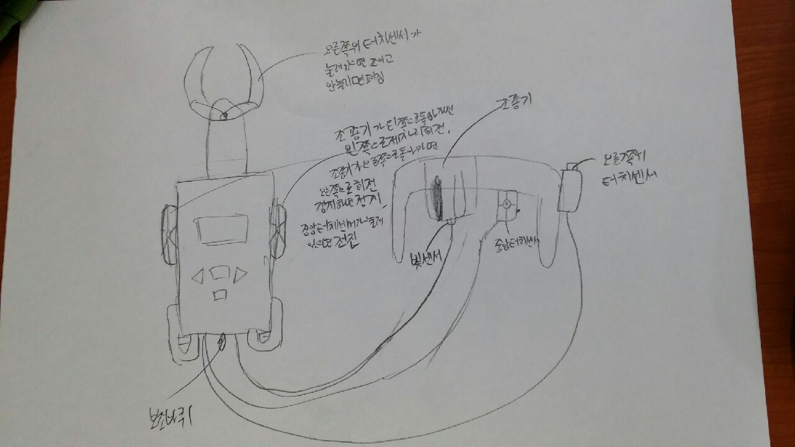
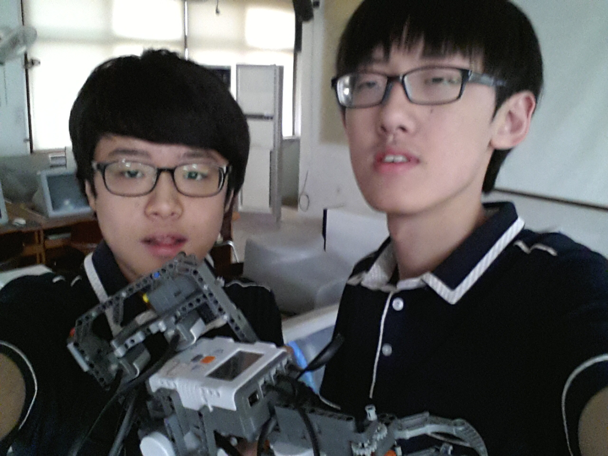
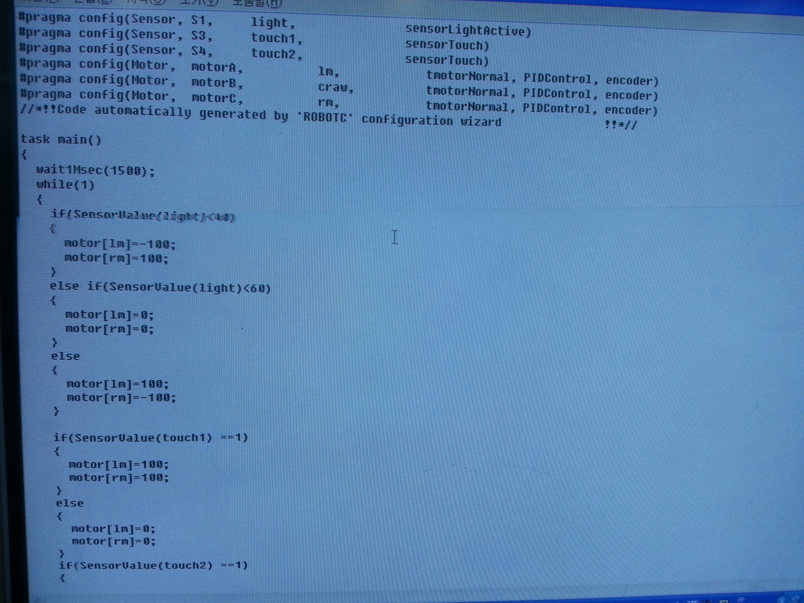

# 오픈소스 과제
## 이력서 만들기

---

## 로봇c언어

고등학교 시절 제가 처음으로 접한 `프로그래밍 언어`였습니다.
그 당시 친구들과 동아리를 정하던 중 고르게 되었고, 막연히 로봇 부품을 조립하는 것으로 생각했던 것과 달리 로봇에게 `명령`을 주는 `프로그램`을 짜는 것은 매우 어려웠습니다. 때문에 꽤 많은 친구들이 `코딩`하는 것을 꺼려했고
이 점이 저의 도전 욕구를 자극했었습니다.
```c
task main()
{
    wait1Msec(1000);

    while(SensorValue(light) <> 40)
    {
        motor[lm] = -100;
        motor[rm] = 100;
    }
    ....
}
```
제가 사용했었던 코드입니다. 조립한 로봇은 앞에 센서가 있어 `밝기`를 측정할 수 있었습니다.


고3 `마지막 프로젝트`에서 만든 `설계도`? 같은 것이였습니다. 제한시간, 한정된 부품을 가지고 만들었던 로봇이며 각 팀마다 만든 로봇으로 3종의 경기를 통해 순위를 가리는 대회였습니다.
경기는 다음과 같습니다.
| 번호 | 경기 |
| ------ | ----------- |
| 1      | 마라톤      |
| 2      | 방해물 피하기 |
| 3      | 투기장      |
---

1경기는 단순히 빨리 달리는 것이며, 2경기는 장해물을 피해서 골인 지점까지 가는 것입니다. 3경기는 원형경기장에서 서로의 로봇을 밀어내는 것이였습니다.

총 6개 팀에서 3등을 기록했습니다. *오른쪽이 접니다*

당시 직접 코딩했던 프로그램입니다.

이 외에도 코딩을 하기위해 `알고리즘`을 직접 그리고 일정에 맞추기 위해 `시간 계획표`등을 짜서 프로잭트에 임하였습니다. 이 경험 떄문에 `코딩`하는 것에 
재미가 붙었고 컴퓨터공학으로 진로를 정하게 되었습니다. 또한 대학교 면접에서도 교수님에게 들려 드릴 수 있었던 재밌는 이야기였습니다.

---
---


# 대학 동아리

반 장난으로 듣기만 해도 한숨이 나오는 `팀 프로잭트`라는 단어지만 과거 경험 덕분인지 마음 한 구석에는 자신감이 있었습니다. 그러던 날에 다가왔던 것이
`동아리 워크샵`이였습니다. 워크샵이라는 단어가 생소했지만 `자유 프로젝트`라는 단어가 머리가 아팠습니다. 늘 내려왔던 과제들은 시켜서 했던 것이라면 이번에는 제 스스로 만드는 것이였으니요. 2학년 2학기 초, 저는 선배들, 동기들에게 제가 무엇을 만들지 발표해야만 했습니다. 이런 저런 고민들 많이 해보던날, 저는 한 가지 확실히 정하기로 했습니다. 바로 `눈에 보이게 만들자`였습니다. 물론 전시회이기 떄문에 뭘 만든 것인지 보여야하지만 
저는 팔을 들라고하면 들고 걸으라고하면 걷는 이런 피드백을 원했습니다.
제가 로봇c언어를 통해 코딩에 재미를 붙여왔기 때문에, 수 많은 코드들로 서로 신호를 주고 받기 보다는 눈에 바로바로 보이는 것에 흥미를 느꼈습니다.
그레서 제가 고른 것이 `게임`이였습니다. 그리고 그 게임을 만들기 위한 것으로 `유니티 엔진`을 골랐습니다. 게임은 간단했습니다. 주인공 캐릭터를 만들고 랜덤으로 생성되는 적을 총으로 쏴서 맞추는 게임, 제 시간의 대부분은
엔진을 다루는 것을 배우는 것에 썻었습니다. 엔진이 사용하는 언어는 c++입니다, 2학년떄는 아직 배우지 않은 언어였지만 대강 읽을 수는 있었고, 책에서 유니티의 도구들을 사용하는 법을 안 뒤, 저는 처음으로 남의 코드들을 찾아 넣었습니다. 굉장히 양심에 찔리는 일 같아서 중요한 것들만 검색해 사용했는데 이 점이 굉장히 후회가 됩니다. 이유는 나중에 다른 개발자가 코딩하는 것을 보게 되었는데, 빠르게 구글링한 코드를 넣고 코드 리펙토링으로 자기것으로 만든 뒤 다음으로 넘어가는 것이 굉장히 효율적이고 멋있게 보였기 때문입니다. 물론 만든 작품을 전시했을 떄, 다른 교수님들도 재밌게 보셨었지만, 이왕 만드는것 스케일을 크게하고 이것저것 코드를 가져와 짜맞추는 것도 좋은 경험이 되지 않았을까 하는 생각에 많은 아쉬움이 남았었습니다.


제가 만들었던 게임 화면입니다. 게임 완성본은 외장하드를 잃어버릴때 같이 사라졌지만 중간에 찍었었던 영상은 다힝히 있었습니다.
*중간에 한마리를 잡자 쭉 나오는 것은 웨이브를 만든 것이였습니다. 좀비 게임처럼요*


---

# 마치며
이력서를 쓸 떄는 더 정돈되고 필요한 정보만 딱딱 써야하지만, 마크다운 도구들 사용하는 김에 제가 잊고 있었던, 혹은 한 번쯤 자랑하고 싶었던 이야기들을 써 보았던 것 같습니다. 그리고 이번 기회에, 제가 왜 컴퓨터 공학을 택했는지 떠올리게 되어 앞으로의 공부에 좋은 원동력이 될 것 같습니다.
이상으로 제 이야기를 봐주셔서 고맙습니다.


